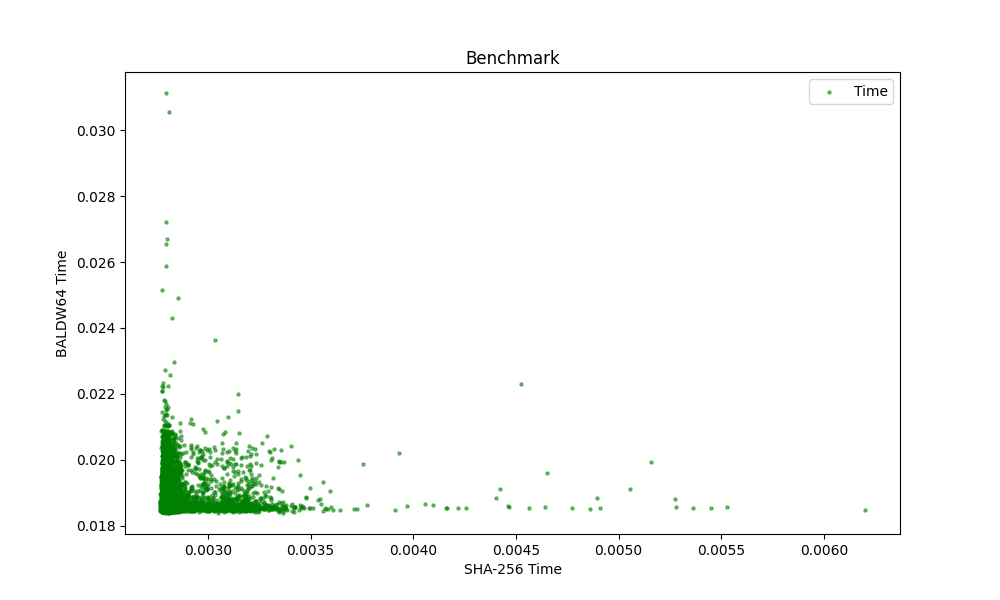
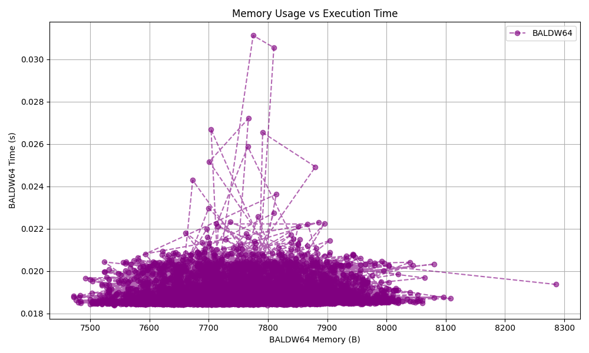
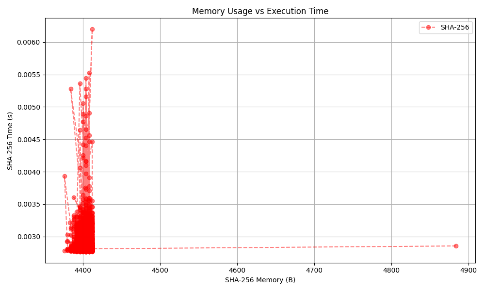

# BALDW64-Hashing-Algorithm

**BALDW64** is a custom-designed general-purpose cryptographic hashing algorithm, inspired from SHA-256, focused on high computational complexity, rich entropy modeling and unique non-linear operations. It emphasizes non-linearity, obfuscation and determinism, while offering a unique output mechanism that blends real digest bits with padded noise for enhanced security.

**Note:** Despite its strength, it's designed for experimental and educational purposes until fully reviewed.

---

## Table of Contents

- Key Features
- Hash Structure
- Bitwise Functions
- Compression Logic
- Entropy & Personalization
- Digest Length Handling
- Performance & Benchmarking
- Security Notice
- License

---

## Key Features

### 1. Fixed Output Length with Obfuscation

- Always generates a 64-byte (512-bit) hash.
- The real digest length is determined by a digital token.
- The first four bytes of the output encode the actual digest length.
- The remaining bytes are obfuscated with fake bits, ensuring collision resistance even for the exact same digests.

### 2. Physically Derived Constants

- Uses 88 unique constants, generated from the permittivity of free space (ε₀).
- Each constant is obtained by scaling and offsetting ε₀ using integers from 1 to 88.
- These constants are critical in the compression rounds and inject real-world entropy into the algorithm.

### 3. 12 Working Variables

- Unlike traditional hash algorithms with 8 working variables (like SHA-256) BALDW64 uses 12.
- These are initialized using points derived from two distinct mathematical curves, contributing to initial entropy.

### 4. Compression with Probabilistic and Logarithmic Message Schedule

- Performs 88 compression rounds using:
-- Non-linear bitwise functions for diffusion.
-- Logarithmic and probabilistic transformations to generate the message schedule.
- Though probabilistic in construction, the logic is fully deterministic for the same input.

### 5. Digital Token-Driven Digest Length

- Requires a user-defined "token", such as:
-- User's email ID
-- User's name
- This signature:
-- Gets normalized first.
-- Determines the real digest size (e.g., 256, 384, 448 bits, etc.).
-- Guarantees that the same input with the same token always yields the same digest length.

### 6. Probabilistic Yet Secure

- Though it utilizes probabilistic mathematics, the behaviour is deterministic:
-- Same input + same token ---> same digest
- This makes it safe for use in systems where reproducibility and verification are required.

---

## Hash Structure

| 0-3 bytes  |      4-N bytes       |    N+1 to 63 bytes   |
|  :------:  |       :------:       |       :------:       |
| Digest Len |Real Digest (X bytes) | Obfuscated Fake Bits |

- **Digest Len:** A 32-bit unsigned integer (little-endian) that tells how many bytes are the actual digest.
- **Real Digest:** Cryptographically compressed hash output.
- **Obfuscated Fake Bits:** Randomized noise to hide actual hash size and confuse brute-force attempts.

---

## Bitwise Functions

These form the non-linear core of BALDW64.

- **rotr(x, n)**
Right rotate a 64-bit integer:
```Python
(x >> n) | (x << (64 - n)) & 0xFFFFFFFFFFFFFFFF
```

- **rotl(x, n)**
Left rotate a 64-bit integer:
```Python
(x << n) | (x >> (64 - n)) & 0xFFFFFFFFFFFFFFFF
```

- **fuse(w, x, y, z)**
Hybrid bitwise logic:
```Python
((w & x) | (w & y)) ^ ((z & x) ^ (z & y))
```

- **diffuse(x, y, z)**
Destructive diffusion logic:
```Python
~(x & ~(x & y)) & ~(z & ~(x & y))
```

- **destr(x, y, z, k)**
Destructive mixing with round constant:
```Python
((x & rotl((x ^ k) + (y & z), 11)) ^ (y & rotl((y ^ k) + (z & x), 17)) ^ (z & rotl((z ^ k) + (z & y), 23)))
```

- **λ0(x) and λ1(x)**
State perturbation functions:
```Python
λ0(x) = rotr(x, 16) & rotr(x, 54) & (x >> 36)
λ1(x) = rotl(x, 5) & rotl(x, 27) & (x << 7)
```

- **Ψ(factors: list, numbers: list)**
Entropy probability based on numeric character distribution in input:
```Python
P = len(factors) / len(numbers) if possible else 0.0
```

---

## Compression Logic

Each input string undergoes the following transformations:

### 1. Initial Preprocessing

- Add **bit 1 at the end** of the message followed by **padding with 0 bits** until the length of message chunk becomes exactly 128 bits lesser than the **nearest multiple** of 1024 bits.
- Break the block into 128-byte chunks.
- Compute `P` using the numeric frequency from input chunk.
- Initialize the message schedule (w) from the chunk and expand `w[0..15]` into `w[0..87]` using `λ0, λ1, log2, rotl` and `P`.

### 2. Initializing 12 Working Variables
```Python
a, b, c, d, e, f, g, h, i0, j, k, l = initial_values_list
```

### 3. 88 Compression Rounds

- Compute nonlinear `φ1, φ2, φ3` values using `diffuse, destr, fuse, λ0, λ1` functions.
- Update working variables.
- Every 11 rounds, shuffle the variable arrangement to enhance the avalanche effect.

---

## Entropy & Personalization

Entropy is injected from:

- A user-defined digital token, affecting:
-- Probabilistic Entropy `P`
-- Determination of length of digest
- `Ψ()` which computes dynamic entropy from numeric distribution in message chunks.

---

## Digest Length Handling

- Digest length dynamically varies from 256 to 496 bits.
- Based on the ASCII sum of the last 8 characters of the token.
- If the digest length is N bits, then the rest of the (512 - N) bits are padded with fake bits for **better collision resistance**.

---

## Performance & Benchmarking

Here are the unbiased benchmark results of BALDW64 against SHA-256 (both implemented in Python from scratch), plotted using Matplotlib:

**1. Execution Time**


**2. Memory Usage vs Execution Time**

- BALDW64


- SHA-256


**3. General Statistics**

- Execution Time (s)

| Algorithm |  Maximum  | Minimum  |   Mean   |  Median  |   Mode   |
|  :------: |  :------: | :------: | :------: | :------: | :------: |
|  BALDW64  |  0.031129 | 0.018382 | 0.018803 | 0.018649 | 0.018542 |
|  SHA-256  |  0.006199 | 0.002767 | 0.002837 | 0.002935 | 0.002790 |

- Memory Usage (B)

| Algorithm |  Maximum  | Minimum  |   Mean   |  Median  |   Mode   |
|  :------: |  :------: | :------: | :------: | :------: | :------: |
|  BALDW64  |    8286   |   7472   | 7761.989 |   7867   |   7847   |
|  SHA-256  |    4884   |   4376   | 4403.439 |   4398   |   4404   |

---

## Security Notice

BALDW64 is an **experimental** algorithm. Although designed with cryptographic rigour, it has **not undergone formal third-party analysis or NIST-level scrutiny**.

Use it for:

- Learning about cryptographic design
- Academic or hobby projects
- Performance benchmarking

Avoid in:

- Production-grade systems
- Real world applications
- Critical cryptographic applications

---

## [License](./LICENSE)

This algorithm is licensed under the Apache 2.0 License.

---

Thanks a lot for checking out this work!
Feel free to ask any doubts!

**Email ID:** roychoudhuryavik@gmail.com

---

